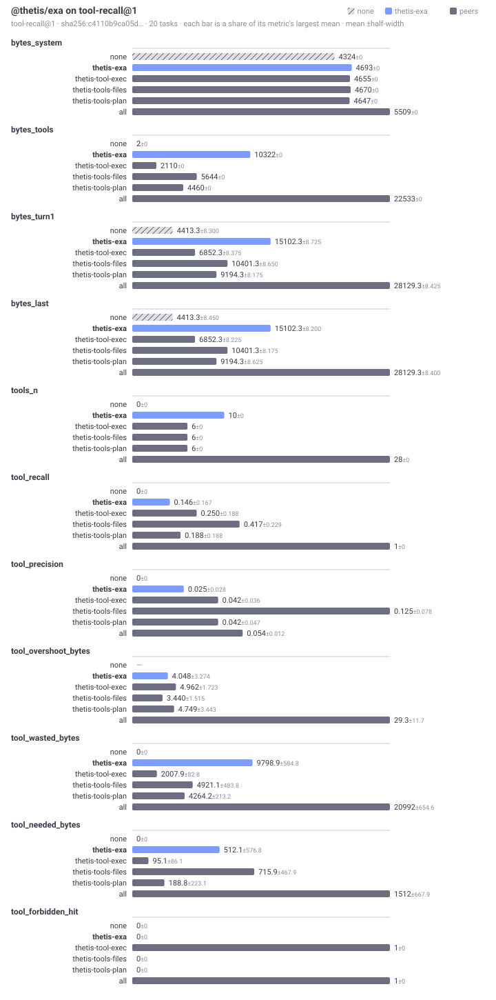

# @thetis/exa

Web search, page contents, summaries, direct answers and research runs through the Exa API, as tools for the model. It is a `tool` package that runs in the fence of whoever installs it. It is not in `systemPackages` by default: a person installs it from the Marketplace place, or an admin installs it for everyone. The fence's network mode must allow outbound HTTPS.

## What it provides

Ten tools, declared in `thetis.tools`. Every tool returns plain text made for a model, except `exa_request`, and a cost line closes each reply when the API reports one.

| Tool | Arguments | Returns |
|---|---|---|
| `exa_search` | `query` (required), `type`, `category`, `numResults`, `includeDomains`, `excludeDomains`, `startPublishedDate`, `endPublishedDate`, `includeText`, `excludeText`, `userLocation`, `text`, `highlights`, `summary`, `maxCharacters`, `maxAgeHours` | Ranked results: title, URL, date, author, score, and highlights by default. |
| `exa_contents` | `urls` (required), `text`, `highlights`, `summary`, `maxCharacters`, `highlightsQuery`, `summaryQuery`, `maxAgeHours`, `livecrawlTimeout`, `subpages`, `subpageTarget`, `links` | The pages: text by default, or highlights, a summary, links and subpages. Pages that could not be fetched are listed with the reason. |
| `exa_summarize` | `urls` (required), `query`, `schema`, `maxAgeHours` | One summary per URL, focused on the question or shaped by the JSON schema. |
| `exa_find_similar` | `url` (required), `numResults`, `excludeSourceDomain`, the domain, date and phrase filters and the content options of `exa_search` | Pages like the given one. |
| `exa_answer` | `query` (required), `text`, `model` (`exa`, `exa-pro`, `exa-fast`, `exa-research`), `systemPrompt`, `outputSchema`, `userLocation`, `maxCharacters` | A grounded answer and the sources it used. |
| `exa_research` | `query` (required), `systemPrompt`, `effort`, `outputSchema`, `previousRunId`, `maxCostDollars` (default 5), `wait` (default true), `waitSeconds` (default 240, at most 540) | The run's text, structured output and sources, polling every 5 seconds; with `wait: false`, the run id at once. |
| `exa_research_get` | `id` (required) | The state and result of a run. |
| `exa_research_cancel` | `id` (required) | Cancels the run. |
| `exa_research_list` | `limit` (default 20, up to 100), `cursor` | Recent runs, newest first, with a cursor for the next page. |
| `exa_request` | `path` (required, under the API root), `method` (default `GET`, or `POST` when a body is given), `body`, `query` | The JSON reply of any endpoint, Websets included. |

Argument values are coerced: a number for `text` means text cut at that many characters; a string for `summary` is the question the summary answers. A failed request becomes `error: Exa <status> on <method> <path>: <message>`. A path that does not start with `/`, that has a host, or that contains `..` is refused before any request.

Bench suites: `assembly-cost@1` and `tool-recall@1`, peer group `tools`. `BENCH.md` in this directory is the generated comparison.



No steps, no service, no UI.

## Configuration

`config.packages["@thetis/exa"]`:

| Key | Default | Meaning |
|---|---|---|
| `apiKey` | none | Required. Write `"${EXA_API_KEY}"` and put the key in `.env` as `EXA_API_KEY`; the CLI interpolates it. A call without a key fails with one sentence naming this field. |
| `baseUrl` | `https://api.exa.ai` | The API root. A proxy goes here. |
| `timeoutMs` | `60000` | Timeout of one HTTP request. |
| `defaults.numResults` | `8` | Results per search when the model does not say. |
| `defaults.maxCharacters` | none | Cap on page text the model gets back, in characters. |
| `defaults.researchWaitSeconds` | `240` | How long `exa_research` waits before returning the id. At most 540. |

The kernel sends this object to the tools as `env.config` and to nothing else.

## Use

```json
"packages": {
  "@thetis/exa": { "apiKey": "${EXA_API_KEY}", "defaults": { "numResults": 8, "maxCharacters": 4000 } }
}
```

Tool calls as the model makes them:

```
exa_search { query: "blog post explaining how prompt caching works in Anthropic's API", numResults: 5, startPublishedDate: "2026-01-01" }
exa_contents { urls: ["https://exa.ai/docs/reference"], text: 4000 }
exa_research { query: "What changed in EU AI Act enforcement in 2026?", effort: "low", wait: false }
exa_research_get { id: "<the run id from exa_research>" }
```

## Files

| File | Content |
|---|---|
| `package.json` | The manifest: ten tools and the bench declaration. |
| `src/client.ts` | `createClient(config, fetch)`: base URL, key header, timeout, error sentences, `checkPath`. |
| `src/format.ts` | The text renderers: results, statuses, citations, answers, runs, lists. |
| `src/tools.ts` | `createTools({ fetch, sleep, now })`: one function per tool, argument coercion, the research poll loop. |
| `src/index.ts` | The exports the manifest names, bound to the global `fetch`. |
| `BENCH.md`, `bench/` | The generated benchmark view and reports. |

## Tests

`npm test` from the runtime root. `test/exa.test.ts` runs every tool against a recorded fake fetch and checks the error sentences and the path guard. One live case runs only when `EXA_API_KEY` is set in the environment.

See docs/19-exa.md in the runtime repository.
