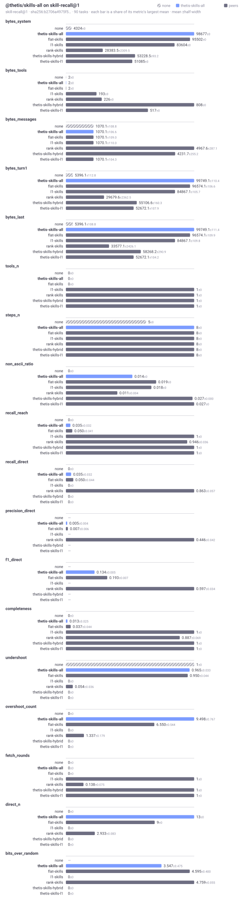
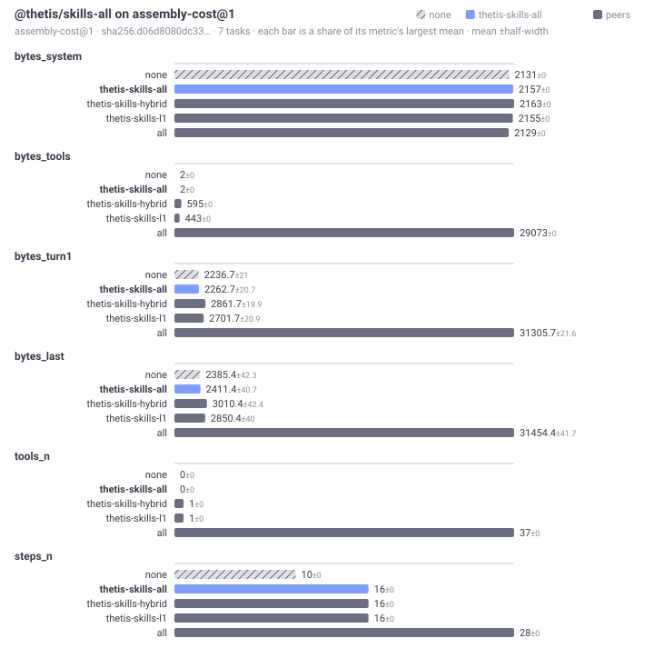

# @thetis/skills-all

The simplest skill loader: every skill's whole body goes into the system prompt on every turn, universal skills first and then by id, until a byte budget is spent. Nothing is a tool call away, and nothing is chosen, so it never chooses wrongly. It pays for that in bytes: the prompt grows with the packs, and a pack larger than the budget is cut at the first skill that does not fit. It is a `loader` with one `prompt` step and the two `bench` steps, plain ECMAScript with no build step, and it imports `@thetis/skills`, which must be installed beside it.

## What it provides

| Step | Phase | Export | Effect |
|---|---|---|---|
| `inject` | `prompt` | `inject` | Reads the skills through `@thetis/skills` (`selectSkills`: errored skills out, the project's `skills.disable` out, universals capped at 8), orders them universal first then by id, and appends `# Skills` with one `## <id>` section per whole body until `config.budget` is spent. Writes the turn's state under `harness["@thetis/skills"]`. |
| `bench-import` | `bench` | `importCorpus` | The shared importer from `@thetis/skills`. Never scheduled on an ordinary turn. |
| `bench-report` | `bench` | `benchReport` | The claim: `direct` the injected ids, `offered` nothing, `reach: "direct"`, `budgetBytes`, `droppedForBudget`. |

The state under `harness["@thetis/skills"]`:

```js
{ loader: "@thetis/skills-all", universal: ["concise"], pinned: [], loaded: [], catalogue: [...injected], injected: [...], dropped: [...], excluded: [...], budget: 98304, used: 41200, notes: [] }
```

`notes` names each skill left out for a lint error, what a project switched off, and another skills loader when one is installed; both loaders run until one is removed.

Bench suites: `skill-recall@1` and `assembly-cost@1`, peer group `skills`, corpus `caps@1`.

## Benchmarks





On `skill-recall@1` this loader puts 13 whole bodies in the prompt for 95,296 bytes of system prompt on every turn and needs no fetch round (fetch_rounds 0), but the corpus is 287 skills and the budget holds the first 13 by id, so recall_reach is 0.035, undershoot 0.965 and overshoot 9.5 unneeded bodies per task. `@thetis/skills-l1` and `@thetis/skills-hybrid` reach every needed skill (recall_reach 1, undershoot 0, overshoot 0) for 47,638 and 49,099 bytes, at the price of one round trip per body. On `assembly-cost@1`, where nothing is installed but the loader, it is the cheapest of the three at 1,053 system bytes over a 1,027 floor and 2 bytes of tool schema per turn, with the same 18 steps.

## Configuration

`config.packages["@thetis/skills-all"]`:

| Key | Default | Effect |
|---|---|---|
| `budget` | 98304 | Bytes of skill text the prompt may carry. Whole skills only. The first skill that does not fit ends the fill; it and the rest are named in `dropped`. |

## Limits

- The prompt carries at most `budget` bytes of skills, and the order is fixed, so with a large pack the skills late in the alphabet never appear. Use `@thetis/skills-l1` or `@thetis/skills-hybrid` for a pack that does not fit.
- The prompt prefix changes whenever a skill changes, which costs the provider cache one miss.

## Files

| File | Content |
|---|---|
| `package.json` | The manifest: the three steps and the bench declaration. |
| `index.js` | `inject`, `importCorpus`, `benchReport`, and the pure `orderOf` and `fill`. |
| `test/inject.test.js` | The prompt block and the state, the budget rule, the project switch, the notes, and the claim over a small corpus. |

## Tests

`npm test` from the runtime root, or `node --test "test/*.test.js"` in this directory.
