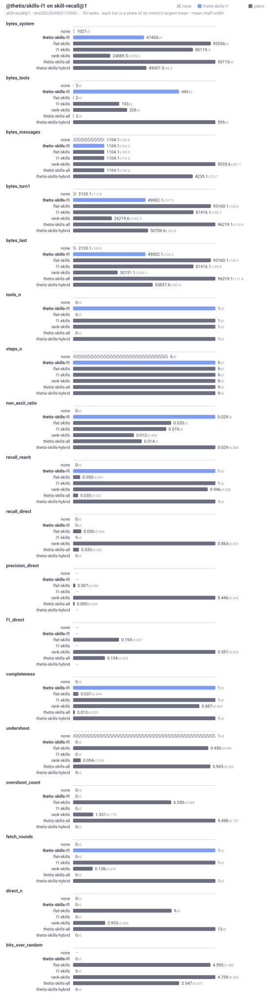
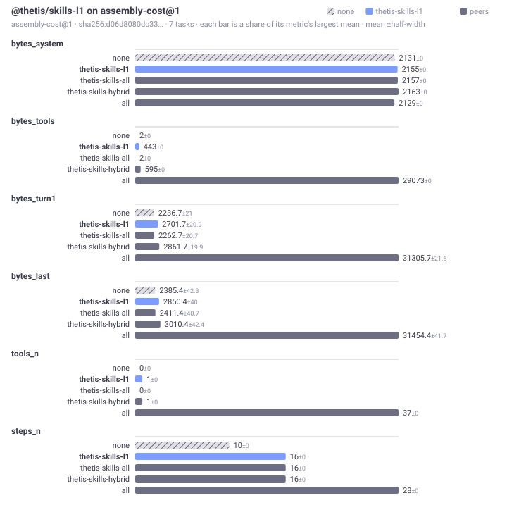

# @thetis/skills-l1

A catalogue loader: one brief per top-level skill in the system prompt, the bodies of universal skills in full, and a tool, `load_skill`, that returns any other body once per conversation. The prompt grows by one line per skill however large the packs get; the price is a round trip before a skill is in hand. A body the model loaded goes into the prefix on the next turn and stays there, so the prefix is stable from then on. It is a `loader` with one `prompt` step, one tool and the two `bench` steps, plain ECMAScript with no build step, and it imports `@thetis/skills`, which must be installed beside it.

## What it provides

| Step | Phase | Export | Effect |
|---|---|---|---|
| `catalogue` | `prompt` | `catalogue` | Appends `# Skills you can load` with one brief per top-level skill, then `# Skills always in force` with the universal bodies, then `# Skills loaded in this conversation` with the bodies the model loaded earlier. Writes the state under `harness["@thetis/skills"]`. |
| `bench-import` | `bench` | `importCorpus` | The shared importer from `@thetis/skills`. |
| `bench-report` | `bench` | `benchReport` | The claim: `direct` the universal and loaded ids, `offered` the catalogue, `reach: "catalogue"`. |

| Tool | Arguments | Returns |
|---|---|---|
| `load_skill` | `name` (required) | The body, then `Skill directory:` and the files beside it. A second call in the same conversation answers `already loaded`. A universal skill answers that it is already in the prompt. A name not in the catalogue is refused with the closest names. A skill the project switched off is not there. Nested skills and files are read with `skill_fetch` from `@thetis/skills`. |

The state under `harness["@thetis/skills"]`:

```js
{ loader: "@thetis/skills-l1", universal: ["concise"], pinned: [], loaded: ["packages"], catalogue: [...top-level ids], dropped: [], excluded: [...], notes: [] }
```

Bench suites: `skill-recall@1` and `assembly-cost@1`, peer group `skills`, corpus `caps@1`.

## Benchmarks





On `skill-recall@1` the catalogue reaches every needed skill (recall_reach 1, undershoot 0, overshoot 0) at one fetch round for 48,602 bytes of system prompt, the smallest of the three loaders, and 443 bytes of tool schema; `@thetis/skills-all` spends 96,260 bytes to reach 0.035 with 9.5 unneeded bodies and no round trip, and `@thetis/skills-hybrid` spends 50,352 and 595 to reach the same 1 with a pinned set the model does not have to look for. What the catalogue does not do is decide: it has no ranking to report, so a body is always a round trip away, chosen by the model from one line each. On `assembly-cost@1` it costs 2,198 system bytes over a 2,174 floor, 443 bytes of tool schema, and 18 steps per turn, between the two siblings.

## How it works

A tool cannot write `harness`, so `load_skill` records each load in `skills-l1/loaded/<session id>.json` under the home, with the skill's content hash and the time. The `catalogue` step reads that file on every turn, puts the loaded bodies back into the prompt, and records their ids in `loaded`. The prefix therefore changes once per load and is stable between loads.

The v2 design gave `load_skill` an `enum` of the known names, so that a hallucinated name failed validation instead of loading nothing. A manifest is static and this runtime has no dynamic tool schema, so the enum cannot be built at declare time. The tool validates the name instead and answers a miss with the closest ids, which is what the model needs to try again.

## Configuration

`config.packages["@thetis/skills-l1"]` has no keys. The package reads no environment variables. It writes `skills-l1/loaded/<session id>.json` in the home.

## Limits

- Only top-level skills are in the catalogue. A nested skill is reached from its parent's card or with `skill_fetch`.
- A body loaded in one conversation is not loaded in another; each conversation starts from the catalogue.
- The model must call the tool: a skill that is never loaded may as well not exist. The tool description says so.

## Files

| File | Content |
|---|---|
| `package.json` | The manifest: the three steps, the tool, the bench declaration. |
| `index.js` | `catalogue`, `loadSkill`, `importCorpus`, `benchReport`. |
| `lib/loaded.js` | The per-conversation record of loads. |
| `test/catalogue.test.js` | The prompt blocks and the state, `load_skill` once per conversation and its re-injection, the refusals, the project switch, the notes, and the claim over a small corpus. |

## Tests

`npm test` from the runtime root, or `node --test "test/*.test.js"` in this directory.
