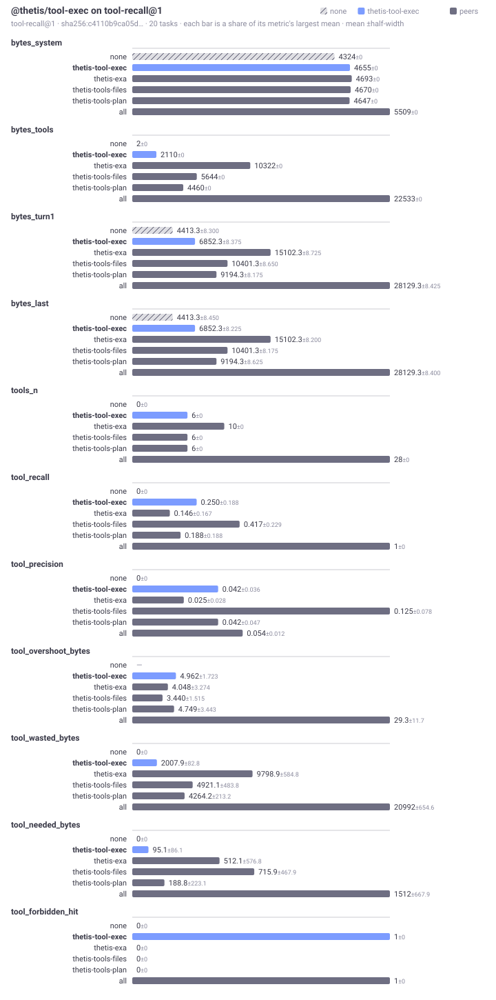

# @thetis/tool-exec

The tools that let the model see and change what is installed in its own userspace and how it is configured: the package list, install and removal, forks and the way back out of one, deletion, configuration, and subagents. It is a `tool` package in the default `systemPackages["*"]`, so it runs in each person's fence; every command it runs and every package it installs stays inside that fence. Reading, editing and searching files is `@thetis/tools-files`.

## What it provides

Nine tools, declared in `thetis.tools`:

| Tool | Arguments | Returns |
|---|---|---|
| `list_packages` | `type` (optional: only packages of that type) | `N packages installed in your userspace:` then one line per package: `- <name>@<version> (<type>): <description> steps[phase:export, …] tools[…] bench[…] service fork of <name>@<version>`. A fork's clause says how far its origin has moved: `fork of @thetis/gateway-web@0.1.1, 0.2.0 is shipped now (unfork_package)`, or, when the copy changed nothing at all, `identical to the shipped 0.2.0: it is carrying no change and will see no further fix (unfork_package)`. The version is the one on disk; when the fence this turn runs in read an older one, the line ends `(loaded 0.2.1, 0.2.2 on disk: a workspace reload applies it)`. This is the list the system prompt used to carry on every call; the prompt now points here instead. |
| `install_package` | `source` (required): a path relative to home, a git URL, or `url#dir` | `installed <name>@<version> (<type>); steps: ...; tools: ...; replaced <name>. Live on the next turn.` |
| `uninstall_package` | `name` (required) | `uninstalled <name>`. The files stay. When the package was a fork, the original comes back. |
| `fork_package` | `name` (required, an installed package), `as` (directory under `packages/`; default the unscoped name) | `forked <name>@<version> to packages/<as> as @<you>/<as>@<version>-fork.N ...` and the next step. Does not install. |
| `unfork_package` | `name` (required, an installed fork), `deleteFiles` (default false) | `<name> is no longer installed; its files were kept. <origin>@<version> is back in its place.` The inverse of `fork_package`: the origin comes back with every change it has had since. Refused when the origin is not on disk here, which is what makes it safe to run on a forked gateway. |
| `delete_package` | `name` (required) | `deleted <name> and its files at <path>; <original> is back in place. Live on the next turn.` Refuses `@thetis/*` packages. |
| `package_config` | `name` (required) | The package's `ConfigReport` as text: the summary sentence, the fork chain it inherits from, one line per key (`key: state [source, inherited from X] = value`), and each declared key's help. A secret is `•••`. |
| `configure_package` | `name`, `key` (required), `value`, `unset`, `json` | `set <key> on <name>: now <state> [<source>]. <name>: <summary>.` and `The service was restarted.` when the package declares a service. With `unset: true` the key leaves the person's layer and the reply says what it falls back to. `json: true` parses `value`. The reply never repeats the value. |
| `spawn_subagent` | `task` (required), `label` (a short name the person sees, such as `research`) | `[subagent <session id> <label>]` on the first line, or `[subagent <session id>]` without a label, then the subagent's final reply. The subagent runs in the same userspace with the same files and packages. Stopping the parent turn stops it: the tool runs with `env.signal` and cancels the child when the signal aborts. A subagent may spawn subagents. |

Bench suites: `assembly-cost@1` and `tool-recall@1`, peer group `tools`. `BENCH.md` in this directory is the generated comparison.



No steps, no service, no UI.

`fork_package` copies the package without `node_modules`, renames it `@<you>/<as>`, gives it the version `<origin>-fork.1` (or `fork.N+1` when a fork is already installed), removes `scripts` and `devDependencies`, links the dependencies the original resolves, and writes `thetis.forkedFrom`. Installing the fork replaces the original in one operation; uninstalling or deleting the fork puts the original back when the registry recorded what it displaced, and `unfork_package` puts it back whether it did or not -- it reads the origin off the fork's own manifest and refuses before it removes anything when that origin is not on disk here. `as` must be one plain directory name.

## Configuration

`config.packages["@thetis/tool-exec"]` has no keys. The package reads no environment variables. The install rules are the kernel's: a person's package must be scoped `@<you>/<name>`, and a `@thetis/*` name installs only for an admin.

## Use

The cycle the model runs to change its own behaviour: write a package with `@thetis/tools-files`, test it, install it.

```
write_path { path: "packages/hello/package.json", contents: "..." }
write_path { path: "packages/hello/index.js", contents: "..." }
exec { cmd: "node -e \"import('./packages/hello/index.js').then(m => console.log(Object.keys(m)))\"" }
install_package { source: "packages/hello" }
```

Change a shipped package, then put it back:

```
fork_package { name: "@thetis/tools-plan" }
edit_path { path: "packages/tools-plan/index.js", old_text: "...", new_text: "..." }
install_package { source: "packages/tools-plan" }
delete_package { name: "@alice/tools-plan" }
```

Hand a task to a subagent and wait for its reply. The label is what the person sees while it works:

```
spawn_subagent { task: "Read packages/gateway-cli/README.md and list every command the CLI accepts.", label: "cli survey" }
```

The reply begins `[subagent s_… cli survey]`. Readers parse that line with `/^\[subagent (s_[a-f0-9]+)(?: ([^\]]*))?\]/`; the web gateway uses it to tie the child's record to the call that spawned it. A stopped child answers `stopped: the subagent was stopped before it finished.` on the second line, with what it had said so far after that; a failed one answers `error: <message>` there.

## Files

| File | Content |
|---|---|
| `package.json` | The manifest: nine tools and the bench declaration. |
| `src/index.ts` | The nine tool functions. Forking is `forkPackage` from `@thetis/lib/pkg-fs`; install, uninstall and delete go through `env.kernel.packages`; subagents through `env.kernel.sessions`, with the cancel cascade on `env.signal`. |
| `BENCH.md`, `bench/` | The generated benchmark view and reports. |

## Tests

The package has no test directory of its own. `npm test` from the runtime root covers it through the host tests: `packages/host/test/e2e.test.ts` runs the write, exec and install cycle through a real fence, and `packages/gateway-web/test/gateway.test.ts` spawns a subagent with the echo provider's `spawn:` cue, checks the result line and the child's record, and stops the parent while the child streams.
