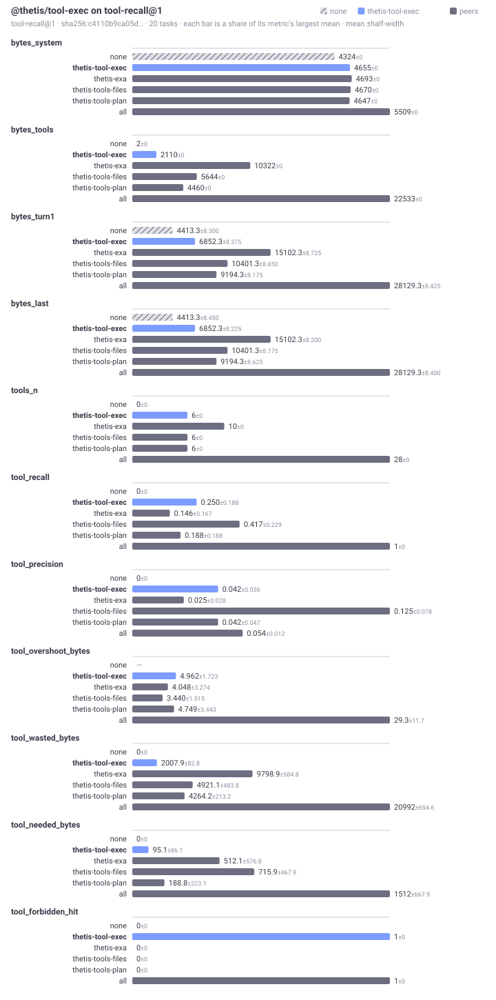

# @thetis/tool-exec

The tools that let the model see and change what is installed in its own userspace and how it is configured: the package list, install and removal, forks and the way back out of one, deletion, configuration, and subagents; and the read-only tools that let it look through the person's other conversations. It is a `tool` package in the default `systemPackages["*"]`, so it runs in each person's fence; every command it runs and every package it installs stays inside that fence. Reading, editing and searching files is `@thetis/tools-files`.

## What it provides

Fourteen tools, declared in `thetis.tools`:

| Tool | Arguments | Returns |
|---|---|---|
| `list_packages` | `type` (optional: only packages of that type) | `N packages installed in your userspace:` then one line per package: `- <name>@<version> (<type>): <description> steps[phase:export, …] tools[…] bench[…] service fork of <name>@<version>`. A fork's clause says how far its origin has moved: `fork of @thetis/gateway-web@0.1.1, 0.2.0 is shipped now (unfork_package)`, or, when the copy changed nothing at all, `identical to the shipped 0.2.0: it is carrying no change and will see no further fix (unfork_package)`. The version is the one on disk; when the fence this turn runs in read an older one, the line ends `(update ready: 0.2.1 runs until this reply ends)`. This is the list the system prompt used to carry on every call; the prompt now points here instead. |
| `install_package` | `source` (required): a path relative to home, a git URL, or `url#dir` | `installed <name>@<version> (<type>); steps: ...; tools: ...; replaced <name>. It takes effect when this reply ends.` The space applies the change once no reply is running. |
| `uninstall_package` | `name` (required) | `uninstalled <name>`. The files stay. When the package was a fork, the original comes back. |
| `fork_package` | `name` (required, an installed package), `as` (directory under `packages/`; default the unscoped name) | `forked <name>@<version> to packages/<as> as @<you>/<as>@<version>-fork.N ...` and the next step. Does not install. |
| `unfork_package` | `name` (required, an installed fork), `deleteFiles` (default false) | `<name> is no longer installed; its files were kept. <origin>@<version> is back in its place. It takes effect when this reply ends.` The inverse of `fork_package`: the origin comes back with every change it has had since. Refused when the origin is not on disk here, which is what makes it safe to run on a forked gateway. |
| `delete_package` | `name` (required) | `deleted <name> and its files at <path>; <original> is back in place. It takes effect when this reply ends.` Refuses `@thetis/*` packages. |
| `package_config` | `name` (required) | The package's `ConfigReport` as text: the summary sentence, the fork chain it inherits from, one line per key (`key: state [source, inherited from X] = value`), and each declared key's help. A secret is `•••`. |
| `configure_package` | `name`, `key` (required), `value`, `unset`, `json` | `set <key> on <name>: now <state> [<source>]. <name>: <summary>.` and `The service was restarted.` when the package declares a service. With `unset: true` the key leaves the person's layer and the reply says what it falls back to. `json: true` parses `value`. The reply never repeats the value. |
| `spawn_subagent` | `task` (required), `label` (a short name the person sees, such as `research`), `model` (a model id; without it the child runs on this conversation's model) | `[subagent <session id> <label>]` on the first line, or `[subagent <session id>]` without a label, then the subagent's final reply. The subagent runs in the same userspace with the same files and packages, and on the model of the parent's turn: `env.model`, which the harness sets from `call.model`, is passed as `sessions.send`'s `model` option, so a conversation the person moved to another model spawns children on that model rather than the installation's default (before 0.4.2 every child ran on the default). Stopping the parent turn stops it: the tool runs with `env.signal` and cancels the child when the signal aborts. A subagent may spawn subagents. A failed child's result ends with how to go on: `Its work so far is kept. To continue it instead of starting again, call resume_subagent with id <id>.` when its error was marked `retryable` or its record kept the turn as `interrupted`, else `Files it wrote before failing are still there; look before starting the work again.` A child whose turn paused at a safe point for a drained restart or an update (a `yield`, no error) did not finish, and nothing resumes a subagent by itself, so it answers `error: the subagent paused at a safe point for a restart of Thetis before it finished.` (or `for an update of this space`), what it had said, and the same `resume_subagent` line; before 0.4.1 its last words were returned as its reply and the rest of its task was dropped. |
| `resume_subagent` | `id` (required: the child's session id, or its whole `[subagent …]` line), `label` (optional, to name it the same way), `model` (optional, as on `spawn_subagent`) | The same shape as `spawn_subagent`. It runs a turn with no input on the child, `sessions.send(id, [])`, on the same model rule as `spawn_subagent`: the turn goes on from the saved conversation, adds no message, and does nothing again that had finished. It refuses a session that is not a child of this conversation. A child whose last turn finished is not run: its last reply is the answer. A child with a turn running answers `busy: …`. |
| `list_conversations` | `show` (`active`, the default: not archived; `archived`, `running`, `interrupted`, `all`), `query` (text in the name, first or last message), `subagents` (default false), `parent` (only that conversation's subagents), `since`, `until`, `limit` (default 20, max 200), `offset` | `<which>, newest first: <a>-<b> of <n>` then per conversation `- <id>  <updated>  "<name>"  <n> turns  running|interrupted (<why>)  archived  subagent of <id>  <n> subagents  (this conversation)` and indented `first:` and `last:` lines cut to 140 characters, then `<n> more: call again with offset <k>.` when there are. |
| `read_conversation` | `id` (required; a pasted `[subagent …]` line works), `offset` (1-based; negative counts from the end; default the last `limit`), `limit` (default 30, max 200), `tools` (`brief`, the default, `full` or `none`), `max_chars` (per message, default 2000, max 20000) | A header with the facts line, when it was created, the message count and its first ten subagents with their labels; a note when compaction covers its start; then `#<n> <role>: <text>` with `  → <tool> <args>` under an assistant message and `#<n> <tool> result: <text>`, a running turn's messages after `-- the running turn, as far as its checkpoint has it --`; then `[showing messages #a-b of n. Earlier: offset x. Later: offset y.]`. |
| `search_conversations` | `pattern` (required, a JavaScript regex; one that matches empty text is refused), `ignore_case` (default true), `roles` (default `user`, `assistant`; `tool` adds tool calls and results), `id` (one conversation), `show` (default `all`), `subagents` (default true), `since`, `until`, `max_results` (default 20), `per_conversation` (default 3), `max_conversations` (default 500), `context` (characters around a hit, default 100) | `<n> matches for /<p>/ in <k> conversations (searched <a> of <b> conversations, newest first).` and why it stopped early, if it did; then per conversation `- <id>  <updated>  "<name>"  archived  subagent of <id>` and `  #<n> <role>: …<context>…` lines. Leaves this conversation out. |
| `summarize_conversation` | `id` (required), `focus` (what the summary is for), `model` (default this turn's model, else the installation's default) | The header of `read_conversation`, the summary, and `[summary of <n> messages by <model>, $<cost>; <k> messages in the middle were left out for length. …]`. A failed request is a thrown error that points at `read_conversation`. |

Bench suites: `assembly-cost@1` and `tool-recall@1`, peer group `tools`. `BENCH.md` in this directory is the generated comparison.



No steps, no service, no UI.

`fork_package` copies the package without `node_modules`, renames it `@<you>/<as>`, gives it the version `<origin>-fork.1` (or `fork.N+1` when a fork is already installed), removes `scripts` and `devDependencies`, links the dependencies the original resolves, and writes `thetis.forkedFrom`. Installing the fork replaces the original in one operation; uninstalling or deleting the fork puts the original back when the registry recorded what it displaced, and `unfork_package` puts it back whether it did or not -- it reads the origin off the fork's own manifest and refuses before it removes anything when that origin is not on disk here. `as` must be one plain directory name.

### Other conversations

The four conversation tools only read. They see what the kernel's `sessions.list` and `sessions.inspect` answer for this fence, which is this person's conversations and no one else's: every conversation, its subagents, the archived ones and the one running now. They send no message, start no turn and change no mark. Their order is always newest update first, the order a person remembers their conversations in.

Two facts are the web gateway's, not the kernel's: a conversation's name and whether it was archived. They are read from the files the gateway keeps in the home, `gateway-web/sessions/<user>/<id>.json`, on every call, because the person renames and archives while the model works. A home without those files has no names and nothing archived. A subagent's label is read from its parent's `spawn_subagent` result, `[subagent <id> <label>]`, the way the gateway reads it.

harness-core's `[Turn context: …]` line is cut from the person's messages before they are shown or searched: it says when a message was sent, and a search for a date would otherwise match every message of that day. A running conversation is read with the messages of its turn so far, from the checkpoint the kernel saves about once a second; a `turn` left on an idle record is an interrupted turn's marker whose messages are already in the conversation, and is not read twice.

`search_conversations` opens records four at a time, newest first, and stops at `max_results` hits or `max_conversations` records, whichever comes first, and says which. It skips the conversation it is called from: what that one said is already in front of the model. Tool results are not searched unless `roles` asks for them, because they are most of a transcript's bytes and little of what a person remembers saying.

`summarize_conversation` is the one tool that spends anything: one provider request with no tools, carrying the transcript as `read_conversation` renders it with brief tools, cut to about 160,000 characters. A longer transcript keeps its first third and its end, and says how many messages were left out; compaction's summary goes first when there is one, so the part it covers is not lost. The request is bounded at three minutes and by the turn's stop.

## Configuration

`config.packages["@thetis/tool-exec"]` has no keys. The package reads no environment variables. The install rules are the kernel's: a person's package must be scoped `@<you>/<name>`, and a `@thetis/*` name installs only for an admin.

## Use

The cycle the model runs to change its own behaviour: write a package with `@thetis/tools-files`, test it, install it.

```
write_path { path: "packages/hello/package.json", contents: "..." }
write_path { path: "packages/hello/index.js", contents: "..." }
exec { cmd: "node -e \"import('./packages/hello/index.js').then(m => console.log(Object.keys(m)))\"" }
install_package { source: "packages/hello" }
```

Change a shipped package, then put it back:

```
fork_package { name: "@thetis/tools-plan" }
edit_path { path: "packages/tools-plan/index.js", old_text: "...", new_text: "..." }
install_package { source: "packages/tools-plan" }
delete_package { name: "@alice/tools-plan" }
```

Hand a task to a subagent and wait for its reply. The label is what the person sees while it works:

```
spawn_subagent { task: "Read packages/gateway-cli/README.md and list every command the CLI accepts.", label: "cli survey" }
```

The reply begins `[subagent s_… cli survey]`. Readers parse that line with `/^\[subagent (s_[a-f0-9]+)(?: ([^\]]*))?\]/`; the web gateway uses it to tie the child's record to the call that spawned it. A stopped child answers `stopped: the subagent was stopped before it finished.` on the second line, with what it had said so far after that; a failed one answers `error: <message>` there.

A child's turn that loses its connection to the model is retried inside the turn by `@thetis/harness-core`. Each retry drops the half-finished round, and the tool drops that round's text from "what it had said so far" when the `harness-core.retry` event with phase `waiting` arrives. When the retries run out, the error result says the child can be continued:

```
resume_subagent { id: "s_1a2b3c4d5e6f", label: "cli survey" }
```

## Files

| File | Content |
|---|---|
| `package.json` | The manifest: fourteen tools and the bench declaration. |
| `src/conversations.ts` | The four conversation tools, over `env.kernel.sessions.list` and `inspect`, and the one summary request through `env.kernel.providers.call`. |
| `src/index.ts` | The ten package and subagent tool functions, and the re-export of the conversation tools. Forking is `forkPackage` from `@thetis/runtime/lib/pkg-fs`; install, uninstall and delete go through `env.kernel.packages`; subagents through `env.kernel.sessions`, with the cancel cascade on `env.signal`. |
| `BENCH.md`, `bench/` | The generated benchmark view and reports. |

## Tests

`npm run build` compiles `test/` beside `src/`; `npm test` runs them. `test/conversations.test.ts` covers the four conversation tools against a fake kernel and a home with the gateway's marks: the filters and paging of the list, the transcript window and a running turn, search roles, dates and stop reasons, and the summary request and its head-and-tail cut. `test/list.test.ts` covers the package lines and the `update ready` suffix; `test/config.test.ts` the configuration tools; `test/subagent.test.ts` the stop cascade, the retry reset of the partial text, the `resume_subagent` hint on a failure and on a child that paused for a restart, and `resume_subagent` itself (a turn with no input, a finished child not run again, a running child, a session of another conversation). `test/host/e2e.test.ts` at the runtime root runs the write, exec and install cycle through a real fence, and `packages/gateway-web/test/gateway.test.ts` spawns a subagent with the echo provider's `spawn:` cue.
