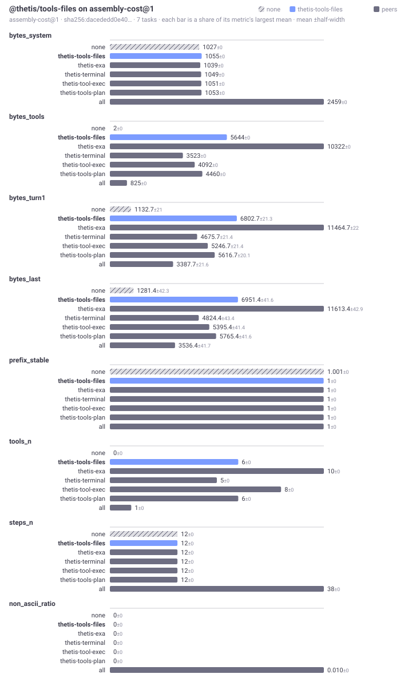
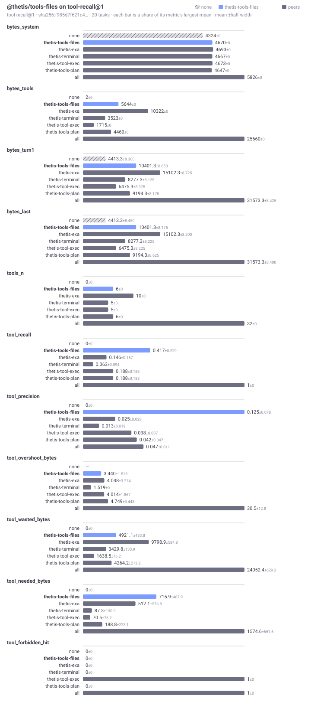

# Bench · @thetis/tools-files

Generated by `@thetis/bench`. Every figure is a mean over tasks with the half-width of a bootstrap interval beside it, which is the smallest difference that many tasks can resolve. Bytes, not tokens: byte density differs between a prose catalogue and a JSON schema, so segments are kept apart rather than summed.

Suites: [`assembly-cost@1`](#suite-assembly-cost-v1), [`tool-recall@1`](#suite-tool-recall-v1).

---

## Suite `assembly-cost@1`

What a package costs the prompt before anything is retrieved: bytes by segment, how much of the prefix survives a turn, and how long assembly takes. No gold, no corpus, no adapter — any package with a step or a tool can opt in.

7 tasks (2 of them controls), probe A.
Generated 2026-09-21T18:39:22.597Z. Digest `sha256:d06d8080dc33…`.

### Compared

Only numbers every arm can produce appear here, and only those on which the arms differ. A mechanism that does not rank cannot have a ranking score, and averaging one in would compare different acts.

| arm | bytes_system | bytes_tools | bytes_turn1 | bytes_last | tools_n | steps_n |
|---|---|---|---|---|---|---|
| none | 2131 ±0 | 2 ±0 | 2236.7 ±21 | 2385.4 ±42.3 | 0 ±0 | 12 ±0 |
| **thetis-tools-files** | 2159 ±0 | 5644 ±0 | 7906.7 ±21.3 | 8055.4 ±41.6 | 6 ±0 | 12 ±0 |
| thetis-exa | 2143 ±0 | 10322 ±0 | 12568.7 ±22 | 12717.4 ±42.9 | 10 ±0 | 12 ±0 |
| thetis-terminal | 2153 ±0 | 3523 ±0 | 5779.7 ±21.4 | 5928.4 ±43.4 | 5 ±0 | 12 ±0 |
| thetis-tool-exec | 2155 ±0 | 4092 ±0 | 6350.7 ±21.4 | 6499.4 ±41.4 | 8 ±0 | 12 ±0 |
| thetis-tools-plan | 2157 ±0 | 4460 ±0 | 6720.7 ±20.1 | 6869.4 ±41.6 | 6 ±0 | 12 ±0 |
| all | 2129 ±0 | 29073 ±0 | 31305.7 ±21.6 | 31454.4 ±41.7 | 37 ±0 | 30 ±0 |

### Against the floor (`none`)

Paired per task, so the constant cost of the harness cancels. `w/t/l` counts the tasks each arm won, tied and lost, which a mean can hide.

| arm | bytes_system | bytes_tools | bytes_turn1 | bytes_last | tools_n | steps_n |
|---|---|---|---|---|---|---|
| thetis-tools-files | 28 [28, 28] 7/0/0 | 5642 [5642, 5642] 7/0/0 | 5670 [5670, 5670] 7/0/0 | 5670 [5670, 5670] 7/0/0 | 6 [6, 6] 7/0/0 | 0 [0, 0] 0/7/0 |
| thetis-exa | 12 [12, 12] 7/0/0 | 10320 [10320, 10320] 7/0/0 | 10332 [10332, 10332] 7/0/0 | 10332 [10332, 10332] 7/0/0 | 10 [10, 10] 7/0/0 | 0 [0, 0] 0/7/0 |
| thetis-terminal | 22 [22, 22] 7/0/0 | 3521 [3521, 3521] 7/0/0 | 3543 [3543, 3543] 7/0/0 | 3543 [3543, 3543] 7/0/0 | 5 [5, 5] 7/0/0 | 0 [0, 0] 0/7/0 |
| thetis-tool-exec | 24 [24, 24] 7/0/0 | 4090 [4090, 4090] 7/0/0 | 4114 [4114, 4114] 7/0/0 | 4114 [4114, 4114] 7/0/0 | 8 [8, 8] 7/0/0 | 0 [0, 0] 0/7/0 |
| thetis-tools-plan | 26 [26, 26] 7/0/0 | 4458 [4458, 4458] 7/0/0 | 4484 [4484, 4484] 7/0/0 | 4484 [4484, 4484] 7/0/0 | 6 [6, 6] 7/0/0 | 0 [0, 0] 0/7/0 |
| all | -2 [-2, -2] 0/0/7 | 29071 [29071, 29071] 7/0/0 | 29069 [29069, 29069] 7/0/0 | 29069 [29069, 29069] 7/0/0 | 37 [37, 37] 7/0/0 | 18 [18, 18] 7/0/0 |

### Assembly latency

Absolute milliseconds are not committed: the fence opens lazily, the sandbox mode differs per machine, and step timing includes serialising the context across the fence, so two machines on this commit would disagree. A ratio against the floor is printed only once a suite has at least 30 tasks and the paired difference clears its own interval — below that the verdict changes between consecutive runs of the same code, which is a reason to say nothing rather than a number to publish. The step count and the byte totals above are the stable part, and they are what assembly time is spent on. Raw timings are in `report.json`.

| arm | steps | assembly vs floor |
|---|---|---|
| none | 12 | floor |
| thetis-tools-files | 12 | not measured at 7 tasks |
| thetis-exa | 12 | not measured at 7 tasks |
| thetis-terminal | 12 | not measured at 7 tasks |
| thetis-tool-exec | 12 | not measured at 7 tasks |
| thetis-tools-plan | 12 | not measured at 7 tasks |
| all | 30 | not measured at 7 tasks |

### Conformance

What each arm claimed it surfaced, against what the assembled prompt actually shows. Every corpus record carries a token a mechanism must preserve however it reformats the text, so a claim is checked rather than believed, and only checked reach is scored.

- **none** — passed
- **thetis-tools-files** — passed
- **thetis-exa** — passed
- **thetis-terminal** — passed
- **thetis-tool-exec** — passed
- **thetis-tools-plan** — passed
- **all** — passed

### Inputs

Two reports are comparable only when these match.

| field | value |
|---|---|
| suite | assembly-cost@1 (sha256:9efc984d505f…) |
| corpus | none |
| arms | none; thetis-exa (@thetis/exa@0.1.0); thetis-terminal (@thetis/terminal@0.1.0); thetis-tool-exec (@thetis/tool-exec@0.1.0); thetis-tools-files (@thetis/tools-files@0.1.0); thetis-tools-plan (@thetis/tools-plan@0.3.0); all (@thetis/exa@0.1.0, @thetis/skills-all@0.1.0, @thetis/skills-hybrid@0.1.0, @thetis/skills-l1@0.1.0, @thetis/terminal@0.1.0, @thetis/tool-exec@0.1.0, @thetis/tools-files@0.1.0, @thetis/tools-plan@0.3.0) |
| model | none — this probe needs no model |
| sandbox | auto |
| scorer | @thetis/bench@0.3.0 |

### Notes

- Every task received the same tools, because nothing installed here decides what to attach per query. So recall is one by construction and means nothing; precision and the wasted bytes are the real figures, and they are the headroom a tool-attention package would have.
- Suite assembly-cost@1 names nothing a task needed, so recall, overshoot and completeness are not computed — only footprint.
- Only 2 control tasks. An arm that bloats the prompt is best caught on tasks no capability should help with; this suite has few.
- 7 tasks is below the 50 at which a percentage is worth quoting. Read the win/tie/loss counts, not the means.

Regenerate with `npm run bench -- run assembly-cost@1`. This section is rewritten only when the inputs above change.

---

## Suite `tool-recall@1`

What share of the tools the model is offered a task actually needed, and what the rest cost. Today every installed tool is attached to every query, so recall is one by construction and the number worth reading is the waste.

20 tasks (4 of them controls), probe A.
Generated 2026-09-16T13:29:09.588Z. Digest `sha256:f985d7f621c4…`.

### Compared

Only numbers every arm can produce appear here, and only those on which the arms differ. A mechanism that does not rank cannot have a ranking score, and averaging one in would compare different acts.

| arm | bytes_system | bytes_tools | bytes_turn1 | bytes_last | tools_n | tool_recall | tool_precision | tool_overshoot_bytes | tool_wasted_bytes | tool_needed_bytes | tool_forbidden_hit |
|---|---|---|---|---|---|---|---|---|---|---|---|
| none | 4324 ±0 | 2 ±0 | 4413.3 ±8.300 | 4413.3 ±8.450 | 0 ±0 | 0 ±0 | 0 ±0 | — | 0 ±0 | 0 ±0 | 0 ±0 |
| **thetis-tools-files** | 4670 ±0 | 5644 ±0 | 10401.3 ±8.650 | 10401.3 ±8.175 | 6 ±0 | 0.417 ±0.229 | 0.125 ±0.078 | 3.440 ±1.515 | 4921.1 ±483.8 | 715.9 ±467.9 | 0 ±0 |
| thetis-exa | 4693 ±0 | 10322 ±0 | 15102.3 ±8.725 | 15102.3 ±8.200 | 10 ±0 | 0.146 ±0.167 | 0.025 ±0.028 | 4.048 ±3.274 | 9798.9 ±584.8 | 512.1 ±576.8 | 0 ±0 |
| thetis-terminal | 4667 ±0 | 3523 ±0 | 8277.3 ±8.125 | 8277.3 ±8.225 | 5 ±0 | 0.063 ±0.094 | 0.013 ±0.019 | 1.519 ±0 | 3429.8 ±130.9 | 87.3 ±130.9 | 0 ±0 |
| thetis-tool-exec | 4673 ±0 | 1715 ±0 | 6475.3 ±8.375 | 6475.3 ±8.225 | 5 ±0 | 0.188 ±0.188 | 0.038 ±0.037 | 4.014 ±1.867 | 1638.5 ±76.2 | 70.5 ±76.2 | 1 ±0 |
| thetis-tools-plan | 4647 ±0 | 4460 ±0 | 9194.3 ±8.175 | 9194.3 ±8.625 | 6 ±0 | 0.188 ±0.188 | 0.042 ±0.047 | 4.749 ±3.443 | 4264.2 ±213.2 | 188.8 ±223.1 | 0 ±0 |
| all | 5826 ±0 | 25660 ±0 | 31573.3 ±8.425 | 31573.3 ±8.400 | 32 ±0 | 1 ±0 | 0.047 ±0.011 | 30.5 ±12.8 | 24052.4 ±629.3 | 1574.6 ±651.6 | 1 ±0 |

### Against the floor (`none`)

Paired per task, so the constant cost of the harness cancels. `w/t/l` counts the tasks each arm won, tied and lost, which a mean can hide.

| arm | bytes_system | bytes_tools | bytes_turn1 | bytes_last | tools_n | tool_recall | tool_precision | tool_wasted_bytes | tool_needed_bytes | tool_forbidden_hit |
|---|---|---|---|---|---|---|---|---|---|---|
| thetis-tools-files | 346 [346, 346] 20/0/0 | 5642 [5642, 5642] 20/0/0 | 5988 [5988, 5988] 20/0/0 | 5988 [5988, 5988] 20/0/0 | 6 [6, 6] 20/0/0 | 0.417 [0.167, 0.667] 7/9/0 | 0.125 [0.052, 0.208] 7/9/0 | 4921.1 [4403.9, 5361.4] 16/0/0 | 715.9 [288.4, 1196.9] 7/9/0 | 0 [0, 0] 0/1/0 |
| thetis-exa | 369 [369, 369] 20/0/0 | 10320 [10320, 10320] 20/0/0 | 10689 [10689, 10689] 20/0/0 | 10689 [10689, 10689] 20/0/0 | 10 [10, 10] 20/0/0 | 0.146 [0, 0.333] 3/13/0 | 0.025 [0, 0.056] 3/13/0 | 9798.9 [9141.3, 10311] 16/0/0 | 512.1 [0, 1169.7] 3/13/0 | 0 [0, 0] 0/1/0 |
| thetis-terminal | 343 [343, 343] 20/0/0 | 3521 [3521, 3521] 20/0/0 | 3864 [3864, 3864] 20/0/0 | 3864 [3864, 3864] 20/0/0 | 5 [5, 5] 20/0/0 | 0.063 [0, 0.188] 1/15/0 | 0.013 [0, 0.038] 1/15/0 | 3429.8 [3255.3, 3517] 16/0/0 | 87.3 [0, 261.8] 1/15/0 | 0 [0, 0] 0/1/0 |
| thetis-tool-exec | 349 [349, 349] 20/0/0 | 1713 [1713, 1713] 20/0/0 | 2062 [2062, 2062] 20/0/0 | 2062 [2062, 2062] 20/0/0 | 5 [5, 5] 20/0/0 | 0.188 [0, 0.375] 3/13/0 | 0.038 [0, 0.075] 3/13/0 | 1638.5 [1550.1, 1709] 16/0/0 | 70.5 [0, 152.4] 3/13/0 | 1 [1, 1] 1/0/0 |
| thetis-tools-plan | 323 [323, 323] 20/0/0 | 4458 [4458, 4458] 20/0/0 | 4781 [4781, 4781] 20/0/0 | 4781 [4781, 4781] 20/0/0 | 6 [6, 6] 20/0/0 | 0.188 [0, 0.375] 3/13/0 | 0.042 [0, 0.094] 3/13/0 | 4264.2 [4019.9, 4453] 16/0/0 | 188.8 [0, 426.4] 3/13/0 | 0 [0, 0] 0/1/0 |
| all | 1502 [1502, 1502] 20/0/0 | 25658 [25658, 25658] 20/0/0 | 27160 [27160, 27160] 20/0/0 | 27160 [27160, 27160] 20/0/0 | 32 [32, 32] 20/0/0 | 1 [1, 1] 16/0/0 | 0.047 [0.037, 0.059] 16/0/0 | 24052.4 [23387.6, 24653.6] 16/0/0 | 1574.6 [976.6, 2283.3] 16/0/0 | 1 [1, 1] 1/0/0 |

### Assembly latency

Absolute milliseconds are not committed: the fence opens lazily, the sandbox mode differs per machine, and step timing includes serialising the context across the fence, so two machines on this commit would disagree. A ratio against the floor is printed only once a suite has at least 30 tasks and the paired difference clears its own interval — below that the verdict changes between consecutive runs of the same code, which is a reason to say nothing rather than a number to publish. The step count and the byte totals above are the stable part, and they are what assembly time is spent on. Raw timings are in `report.json`.

| arm | steps | assembly vs floor |
|---|---|---|
| none | 5 | floor |
| thetis-tools-files | 5 | not measured at 20 tasks |
| thetis-exa | 5 | not measured at 20 tasks |
| thetis-terminal | 5 | not measured at 20 tasks |
| thetis-tool-exec | 5 | not measured at 20 tasks |
| thetis-tools-plan | 5 | not measured at 20 tasks |
| all | 5 | not measured at 20 tasks |

### Conformance

What each arm claimed it surfaced, against what the assembled prompt actually shows. Every corpus record carries a token a mechanism must preserve however it reformats the text, so a claim is checked rather than believed, and only checked reach is scored.

- **none** — passed
- **thetis-tools-files** — passed
- **thetis-exa** — passed
- **thetis-terminal** — passed
- **thetis-tool-exec** — passed
- **thetis-tools-plan** — passed
- **all** — passed

### Inputs

Two reports are comparable only when these match.

| field | value |
|---|---|
| suite | tool-recall@1 (sha256:0556cbbda134…) |
| corpus | none |
| arms | none; thetis-exa (@thetis/exa@0.1.0); thetis-terminal (@thetis/terminal@0.1.0); thetis-tool-exec (@thetis/tool-exec@0.1.0); thetis-tools-files (@thetis/tools-files@0.1.0); thetis-tools-plan (@thetis/tools-plan@0.3.0); all (@thetis/exa@0.1.0, @thetis/terminal@0.1.0, @thetis/tool-exec@0.1.0, @thetis/tools-files@0.1.0, @thetis/tools-plan@0.3.0) |
| model | none — this probe needs no model |
| sandbox | none |
| scorer | @thetis/bench@0.3.0 |

### Notes

- Every task received the same tools, because nothing installed here decides what to attach per query. So recall is one by construction and means nothing; precision and the wasted bytes are the real figures, and they are the headroom a tool-attention package would have.
- Suite tool-recall@1 names the tools each task needed but no capabilities, so the capability columns are absent. The tool gold is authored rather than imported; `packages/bench/suites/tool-recall-v1/GOLD.md` says why that is defensible for tools and would not be for skills.
- 20 tasks is below the 50 at which a percentage is worth quoting. Read the win/tie/loss counts, not the means.

Regenerate with `npm run bench -- run tool-recall@1`. This section is rewritten only when the inputs above change.

---
