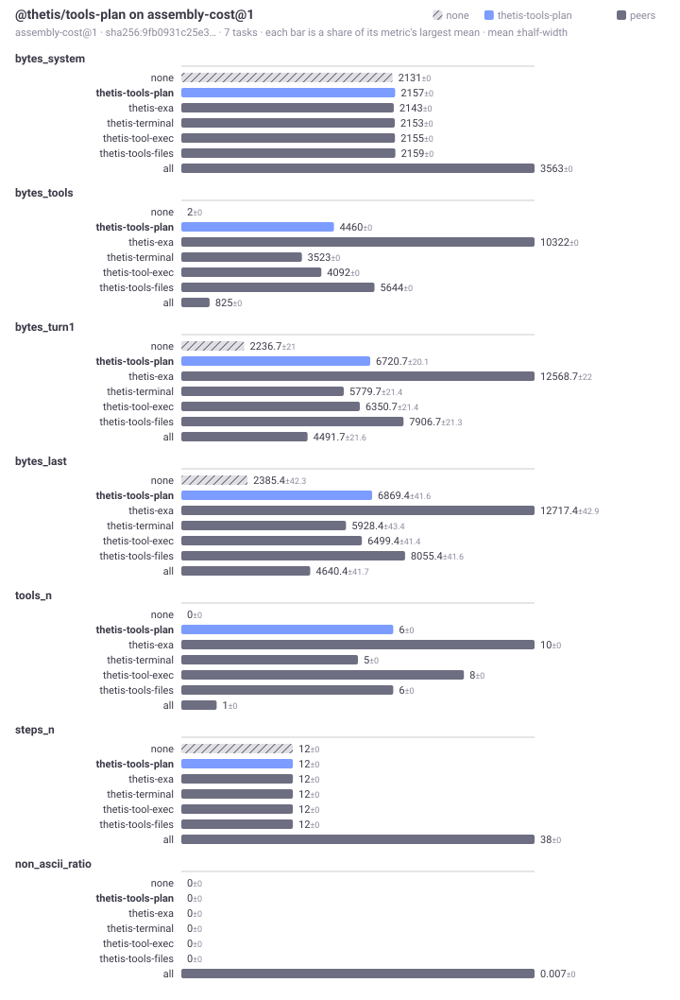

# Bench · @thetis/tools-plan

Generated by `@thetis/bench`. Every figure is a mean over tasks with the half-width of a bootstrap interval beside it, which is the smallest difference that many tasks can resolve. Bytes, not tokens: byte density differs between a prose catalogue and a JSON schema, so segments are kept apart rather than summed.

---

## Suite `assembly-cost@1`

What a package costs the prompt before anything is retrieved: bytes by segment, how much of the prefix survives a turn, and how long assembly takes. No gold, no corpus, no adapter — any package with a step or a tool can opt in.

7 tasks (2 of them controls), probe A.
Generated 2026-09-22T07:38:55.573Z. Digest `sha256:dacededd0e40…`.

### Compared

Only numbers every arm can produce appear here, and only those on which the arms differ. A mechanism that does not rank cannot have a ranking score, and averaging one in would compare different acts.

| arm | bytes_system | bytes_tools | bytes_turn1 | bytes_last | tools_n | steps_n | non_ascii_ratio |
|---|---|---|---|---|---|---|---|
| none | 2174 ±0 | 2 ±0 | 2279.7 ±21 | 2428.4 ±42.3 | 0 ±0 | 12 ±0 | 0 ±0 |
| **thetis-tools-plan** | 2200 ±0 | 4460 ±0 | 6763.7 ±20.1 | 6912.4 ±41.6 | 6 ±0 | 12 ±0 | 0 ±0 |
| thetis-exa | 2186 ±0 | 10322 ±0 | 12611.7 ±22 | 12760.4 ±42.9 | 10 ±0 | 12 ±0 | 0 ±0 |
| thetis-terminal | 2196 ±0 | 3523 ±0 | 5822.7 ±21.4 | 5971.4 ±43.4 | 5 ±0 | 12 ±0 | 0 ±0 |
| thetis-tool-exec | 2198 ±0 | 4092 ±0 | 6393.7 ±21.4 | 6542.4 ±41.4 | 8 ±0 | 12 ±0 | 0 ±0 |
| thetis-tools-files | 2202 ±0 | 5644 ±0 | 7949.7 ±21.3 | 8098.4 ±41.6 | 6 ±0 | 12 ±0 | 0 ±0 |
| all | 3606 ±0 | 825 ±0 | 4534.7 ±21.6 | 4683.4 ±41.7 | 1 ±0 | 38 ±0 | 0.007 ±0 |

### Against the floor (`none`)

Paired per task, so the constant cost of the harness cancels. `w/t/l` counts the tasks each arm won, tied and lost, which a mean can hide.

| arm | bytes_system | bytes_tools | bytes_turn1 | bytes_last | tools_n | steps_n | non_ascii_ratio |
|---|---|---|---|---|---|---|---|
| thetis-tools-plan | 26 [26, 26] 7/0/0 | 4458 [4458, 4458] 7/0/0 | 4484 [4484, 4484] 7/0/0 | 4484 [4484, 4484] 7/0/0 | 6 [6, 6] 7/0/0 | 0 [0, 0] 0/7/0 | 0 [0, 0] 0/7/0 |
| thetis-exa | 12 [12, 12] 7/0/0 | 10320 [10320, 10320] 7/0/0 | 10332 [10332, 10332] 7/0/0 | 10332 [10332, 10332] 7/0/0 | 10 [10, 10] 7/0/0 | 0 [0, 0] 0/7/0 | 0 [0, 0] 0/7/0 |
| thetis-terminal | 22 [22, 22] 7/0/0 | 3521 [3521, 3521] 7/0/0 | 3543 [3543, 3543] 7/0/0 | 3543 [3543, 3543] 7/0/0 | 5 [5, 5] 7/0/0 | 0 [0, 0] 0/7/0 | 0 [0, 0] 0/7/0 |
| thetis-tool-exec | 24 [24, 24] 7/0/0 | 4090 [4090, 4090] 7/0/0 | 4114 [4114, 4114] 7/0/0 | 4114 [4114, 4114] 7/0/0 | 8 [8, 8] 7/0/0 | 0 [0, 0] 0/7/0 | 0 [0, 0] 0/7/0 |
| thetis-tools-files | 28 [28, 28] 7/0/0 | 5642 [5642, 5642] 7/0/0 | 5670 [5670, 5670] 7/0/0 | 5670 [5670, 5670] 7/0/0 | 6 [6, 6] 7/0/0 | 0 [0, 0] 0/7/0 | 0 [0, 0] 0/7/0 |
| all | 1432 [1432, 1432] 7/0/0 | 823 [823, 823] 7/0/0 | 2255 [2255, 2255] 7/0/0 | 2255 [2255, 2255] 7/0/0 | 1 [1, 1] 7/0/0 | 26 [26, 26] 7/0/0 | 0.007 [0.007, 0.007] 7/0/0 |

### Assembly latency

Absolute milliseconds are not committed: the fence opens lazily, the sandbox mode differs per machine, and step timing includes serialising the context across the fence, so two machines on this commit would disagree. A ratio against the floor is printed only once a suite has at least 30 tasks and the paired difference clears its own interval — below that the verdict changes between consecutive runs of the same code, which is a reason to say nothing rather than a number to publish. The step count and the byte totals above are the stable part, and they are what assembly time is spent on. Raw timings are in `report.json`.

| arm | steps | assembly vs floor |
|---|---|---|
| none | 12 | floor |
| thetis-tools-plan | 12 | not measured at 7 tasks |
| thetis-exa | 12 | not measured at 7 tasks |
| thetis-terminal | 12 | not measured at 7 tasks |
| thetis-tool-exec | 12 | not measured at 7 tasks |
| thetis-tools-files | 12 | not measured at 7 tasks |
| all | 38 | not measured at 7 tasks |

### Conformance

What each arm claimed it surfaced, against what the assembled prompt actually shows. Every corpus record carries a token a mechanism must preserve however it reformats the text, so a claim is checked rather than believed, and only checked reach is scored.

- **none** — passed
- **thetis-tools-plan** — passed
- **thetis-exa** — passed
- **thetis-terminal** — passed
- **thetis-tool-exec** — passed
- **thetis-tools-files** — passed
- **all** — passed

### Inputs

Two reports are comparable only when these match.

| field | value |
|---|---|
| suite | assembly-cost@1 (sha256:9efc984d505f…) |
| corpus | none |
| arms | none; thetis-exa (@thetis/exa@0.1.0); thetis-terminal (@thetis/terminal@0.1.0); thetis-tool-exec (@thetis/tool-exec@0.1.0); thetis-tools-files (@thetis/tools-files@0.1.0); thetis-tools-plan (@thetis/tools-plan@0.3.0); all (@thetis/exa@0.1.0, @thetis/skills-all@0.1.0, @thetis/skills-hybrid@0.2.0, @thetis/skills-l1@0.1.0, @thetis/terminal@0.1.0, @thetis/tool-exec@0.1.0, @thetis/tool-groups@0.2.0, @thetis/tools-files@0.1.0, @thetis/tools-plan@0.3.0) |
| model | none — this probe needs no model |
| sandbox | auto |
| scorer | @thetis/bench@0.4.0 |

### Notes

- Every task received the same tools, because nothing installed here decides what to attach per query. So recall is one by construction and means nothing; precision and the wasted bytes are the real figures, and they are the headroom a tool-attention package would have.
- Suite assembly-cost@1 names nothing a task needed, so recall, overshoot and completeness are not computed — only footprint.
- Only 2 control tasks. An arm that bloats the prompt is best caught on tasks no capability should help with; this suite has few.
- 7 tasks is below the 50 at which a percentage is worth quoting. Read the win/tie/loss counts, not the means.

Regenerate with `npm run bench -- run assembly-cost@1`. This section is rewritten only when the inputs above change.

---
